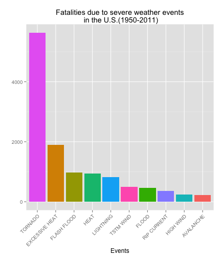
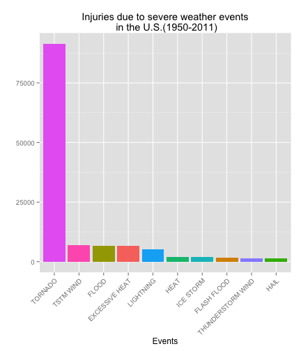

# Impact of Severe Weather Events on Public Health and Economy

## Synopsis
In this report we aim to find the most harmful weather event in the United States between the years 1950 and 2011. As many serious consequences would follow from severe weather events, we will focus on their impact on public health and economy, and the data from U.S. National Oceanic and Atmospheric Administration's (NOAA) storm database is used, which tracks characteristics of major storms and weather events in the United States, including when and where they occur, as well as estimates of any fatalities, injuries, and property damage. As an exploratory analysis, we use the dataset to otained the top ten dangerous events in each aspect. We found that **Tornado** caused the highest fatalities and injuries across the United States. In addition, **Flood** has the greatest impact on economy. 

## Data Processing
As the dataset is huge, to reduce the processing time we set *cache=TRUE*.

```r
library(knitr)
opts_chunk$set(cache=TRUE)
```
As a first step, we load some packages required for this analysis and set the correct working directory.

```r
library(ggplot2)
library(plyr)
setwd("~/DataScience/Reproducible_research/")
```
Then we can load data with *read.csv* function.

```r
storm_data<-read.csv(bzfile("repdata-data-StormData.csv.bz2",open=""),na.strings="NA",sep=",")
```
Now we can take a look of the summary of the dataset. The dataset has 902297 observations and 37 columns. And we can see the column names of this dataset from the *head* function. As we are only interested in the damages caused by different severe weather events across the United States, according to the COOK BOOK, the columns relevant to our analysis are "FATALITIES", "INJURIES","PROPDMG", "CROPDMG",etc...

```r
dim(storm_data)
```

```
## [1] 902297     37
```

```r
head(storm_data,3)
```

```
##   STATE__          BGN_DATE BGN_TIME TIME_ZONE COUNTY COUNTYNAME STATE
## 1       1 4/18/1950 0:00:00     0130       CST     97     MOBILE    AL
## 2       1 4/18/1950 0:00:00     0145       CST      3    BALDWIN    AL
## 3       1 2/20/1951 0:00:00     1600       CST     57    FAYETTE    AL
##    EVTYPE BGN_RANGE BGN_AZI BGN_LOCATI END_DATE END_TIME COUNTY_END
## 1 TORNADO         0                                               0
## 2 TORNADO         0                                               0
## 3 TORNADO         0                                               0
##   COUNTYENDN END_RANGE END_AZI END_LOCATI LENGTH WIDTH F MAG FATALITIES
## 1         NA         0                      14.0   100 3   0          0
## 2         NA         0                       2.0   150 2   0          0
## 3         NA         0                       0.1   123 2   0          0
##   INJURIES PROPDMG PROPDMGEXP CROPDMG CROPDMGEXP WFO STATEOFFIC ZONENAMES
## 1       15    25.0          K       0                                    
## 2        0     2.5          K       0                                    
## 3        2    25.0          K       0                                    
##   LATITUDE LONGITUDE LATITUDE_E LONGITUDE_ REMARKS REFNUM
## 1     3040      8812       3051       8806              1
## 2     3042      8755          0          0              2
## 3     3340      8742          0          0              3
```
With a close examination of the name of events stored in the "EVTYPE" columns, we found there are many repeated records, such as "WATERSPOUT/ TORNADO", "WATERSPOUT-TORNADO", "WATERSPOUT/TORNADO", which should correspond to the same event. So we replace all of the punctuation characters with a space.(Although there are still lots of the preprocessing can be down with the event names, such as replace *tstm* with *thunderstorm*, we will leave them for further analysis.)

```r
ntypes<-length(unique(storm_data$EVTYPE))
ntypes
```

```
## [1] 985
```

```r
a<-sort(unique(toupper(storm_data$EVTYPE)))
length(a)
```

```
## [1] 898
```

```r
a[889:891]
```

```
## [1] "WINTER STORM HIGH WINDS" "WINTER STORM/HIGH WIND" 
## [3] "WINTER STORM/HIGH WINDS"
```

```r
# we replace all punctuation characters with a space character
type_names<-toupper(storm_data$EVTYPE)
storm_data$EVTYPE<-gsub("[[:punct:]+]", " ", type_names)
```

We define two functions. The *sumsort* function takes a string *typename* and a dataset as input and returns a data frame with two colunms. The first column is the event type corresponding to the *EVTYPE* column in the original dataset. In the second column, values in the original *typename* column are summed up by event types and sorted in descending order, as revealed by the function name.

```r
# write a function to extract the data for different damage type
sumsort<-function(typename,dataset){
  data_by_type<-aggregate(dataset[,typename]~dataset[,"EVTYPE"],FUN=sum,na.rm=TRUE)
  colnames(data_by_type)<-c("EVTYPE",typename)
  sort_type<-data_by_type[order(data_by_type[,typename],decreasing=TRUE),]
} 
```
The real amounts of property and crop damages, which correspond to columns named as "PROPDMG" and "CROPDMG" in the dataset, need to be ajusted by their magnitude shown in the "PROPDMGEXP" and "CROPDMGEXP" columns. The magnitudes are hundred("H"),thousand("K"), million("M") and billion("B"). So we define function *ecodamages* to convert the property and crop damages to the correct value and store them in the original position("PROPDMG" and "CROPDMG").

```r
# convert damages to real amount using the multiplier provided
ecodamages<-function(damgtype,damgexp,dataset){
  index1<-which(colnames(dataset)==toupper(damgtype))
  index2<-which(colnames(dataset)==toupper(damgexp))
  multps<-c("H","K","M","B")
  exps<-c(2,3,6,9)
  for (i in 1:length(multps)){
    rows1<-toupper(dataset[,index2])==multps[i]
    rows2<-dataset[,index1]!=0
    dataset[rows1&rows2,index1]<-dataset[rows1&rows2,index1]*10^exps[i]
  }
  dataset
}
```
Here we use functions defined above to get a subset of the original data with only the related columns and summed damages.

```r
new_data<-ecodamages("CROPDMG","CROPDMGEXP",storm_data)
new_data<-ecodamages("PROPDMG","PROPDMGEXP",new_data)
sub_data<-new_data[,c("EVTYPE","FATALITIES","INJURIES","PROPDMG","PROPDMGEXP","CROPDMG","CROPDMGEXP")]
```
## Results
First we can look at which event occurs most frequently.

```r
event_freq<-as.data.frame(table(sub_data$EVTYPE))
event_freq<-event_freq[order(event_freq[,"Freq"],decreasing=TRUE),]
head(event_freq,10)
```

```
##                   Var1   Freq
## 209               HAIL 288661
## 762          TSTM WIND 219942
## 671  THUNDERSTORM WIND  82564
## 741            TORNADO  60652
## 138        FLASH FLOOD  54277
## 154              FLOOD  25327
## 697 THUNDERSTORM WINDS  20843
## 314          HIGH WIND  20214
## 410          LIGHTNING  15754
## 270         HEAVY SNOW  15708
```
We find although the table shows the most frequent event is *HAIL*, but as *TSTM WIND*, *THUNDERSTROM WIND* and *THUNDERSTORM WINDS* all represent the same event, it should be the most common event.

### Across the United States, which types of events (as indicated in the EVTYPE variable) are most harmful with respect to population health?
The following results shows the top 10 weather evenets that cause for the highest fatalities and injuries.

```r
fata_sum<-sumsort("FATALITIES",sub_data)[1:10,]
fata_sum
```

```
##             EVTYPE FATALITIES
## 741        TORNADO       5633
## 116 EXCESSIVE HEAT       1903
## 138    FLASH FLOOD        978
## 240           HEAT        937
## 410      LIGHTNING        816
## 762      TSTM WIND        504
## 154          FLOOD        470
## 515    RIP CURRENT        368
## 314      HIGH WIND        248
## 19       AVALANCHE        224
```

```r
injur_sum<-sumsort("INJURIES",sub_data)[1:10,]
injur_sum
```

```
##                EVTYPE INJURIES
## 741           TORNADO    91346
## 762         TSTM WIND     6957
## 154             FLOOD     6789
## 116    EXCESSIVE HEAT     6525
## 410         LIGHTNING     5230
## 240              HEAT     2100
## 382         ICE STORM     1975
## 138       FLASH FLOOD     1777
## 671 THUNDERSTORM WIND     1488
## 209              HAIL     1361
```
To obtain a more intuitive understanding of the data, we plot the 10 most dangerous events for each type of damage.

```r
ggplot(fata_sum,aes(x=reorder(EVTYPE,-FATALITIES),y=FATALITIES,fill=EVTYPE))+labs(title="Fatalities due to severe weather events\n in the U.S.(1950-2011)",x="Events",y="")+theme(axis.text.x=element_text(angle=45,hjust=1),legend.position="none")+geom_bar(stat="identity")
```

 

Above figure shows the top 10 weather events that cause the most fatalities and the figure below shows the top 10 weather events that cause the most injuries across the United States in 1950-2011.


```r
ggplot(injur_sum,aes(x=reorder(EVTYPE,-INJURIES),y=INJURIES,fill=EVTYPE))+labs(title="Injuries due to severe weather events\n in the U.S.(1950-2011)",x="Events",y="")+theme(axis.text.x=element_text(angle=45,hjust=1),legend.position="none")+geom_bar(stat="identity")
```

 

From above analysis we find the most harmful weather events to population health is **TORNADO**, which has the highest fatalities and the highest injuries across the United States from 1950 to 2011.

### Across the United States, which types of events have the greatest economic consequences?

```r
prop_sum<-sumsort("PROPDMG",sub_data)
head(prop_sum,10)
```

```
##                EVTYPE      PROPDMG
## 154             FLOOD 144657709807
## 366 HURRICANE TYPHOON  69305840000
## 741           TORNADO  56937160779
## 585       STORM SURGE  43323536000
## 138       FLASH FLOOD  16140812067
## 209              HAIL  15732267543
## 357         HURRICANE  11868319010
## 755    TROPICAL STORM   7703890550
## 866      WINTER STORM   6688497251
## 314         HIGH WIND   5270046295
```

```r
crop_sum<-sumsort("CROPDMG",sub_data)
head(crop_sum,10)
```

```
##                EVTYPE     CROPDMG
## 84            DROUGHT 13972566000
## 154             FLOOD  5661968450
## 519       RIVER FLOOD  5029459000
## 382         ICE STORM  5022113500
## 209              HAIL  3025954473
## 357         HURRICANE  2741910000
## 366 HURRICANE TYPHOON  2607872800
## 138       FLASH FLOOD  1421317100
## 125      EXTREME COLD  1312973000
## 185      FROST FREEZE  1094186000
```
We observe that **FLOOD** cause the highest property damages and **DROUGHT** cause the highest crop damages. To analyze which event has the greatest economic impact, we need to combine the two datasets and reorder it according to the total damages.


```r
eco_sum<-merge(prop_sum,crop_sum,by="EVTYPE")
eco_sum$TOTALDMG<-eco_sum[,"PROPDMG"]+eco_sum[,"CROPDMG"]
eco_sum<-eco_sum[order(eco_sum[,"TOTALDMG"],decreasing=TRUE),]
eco_sum<-eco_sum[1:10,1:3]
eco_sum
```

```
##                EVTYPE      PROPDMG     CROPDMG
## 154             FLOOD 144657709807  5661968450
## 366 HURRICANE TYPHOON  69305840000  2607872800
## 741           TORNADO  56937160779   414953270
## 585       STORM SURGE  43323536000        5000
## 209              HAIL  15732267543  3025954473
## 138       FLASH FLOOD  16140812067  1421317100
## 84            DROUGHT   1046106000 13972566000
## 357         HURRICANE  11868319010  2741910000
## 519       RIVER FLOOD   5118945500  5029459000
## 382         ICE STORM   3944927860  5022113500
```

```r
library(reshape2)
eco_sum<-melt(eco_sum,id.var="EVTYPE")
ggplot(eco_sum,aes(x=reorder(EVTYPE,-value),y=value/10^9,fill=variable))+labs(title="Property and crop damages due to severe weather events\n in the U.S.(1950-2011)",x="Events",y="Cost of damages(billions USD)")+theme(axis.text.x=element_text(angle=45,hjust=1))+geom_bar(stat="identity")
```

 

The above graph shows the top 10 weather events that have the greatest impact on economy, including both property damages and crop damages. Now from above graph we observe that **FLOOD** has the greatest economical cost, and the total damage caused by flood is way higher than the damage caused by other events.
